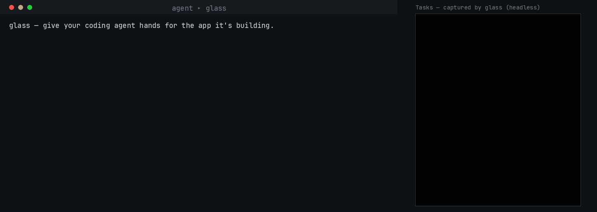

# glass

[](https://github.com/fixed-width/glass/actions/workflows/ci.yml)  
[](https://glama.ai/mcp/servers/fixed-width/glass)

**Give your coding agent hands for the app it's building** — launch it, drive it, and verify the
result, without burning a screenshot on every step.

A Rust [MCP](https://modelcontextprotocol.io) server that gives an AI coding agent a closed **build →
see → interact → debug** loop over external native GUI applications.

glass lets an agent launch a GUI app, capture what is on screen, inject mouse and keyboard input, read
the app's logs, and detect visual changes — so a coding agent can build and debug UI applications
independently instead of asking the user "does this look right?".

glass drives apps as an external black box, so it works with any native GUI app regardless of toolkit
or language. It has two Linux backends (**X11** and **Wayland**), a **Windows** backend, an
**Android** backend (an AVD emulator, driven over `adb` from any host), an **iOS** backend (native
apps in the Simulator over `xcrun simctl`, with input and the accessibility tree via `idb_companion`;
multi-touch gestures excepted), and a **macOS** backend, behind a platform-agnostic core.

## See it



An agent building a GUI app runs it under glass, reproduces a bug **from the accessibility tree**
(no screenshots), fixes the code, and re-verifies — the loop it otherwise can't close on its own.
[Try it yourself](#try-it-in-60-seconds).

## Try it in 60 seconds

1. Download glass for your platform from the [Releases page](https://github.com/fixed-width/glass/releases/latest)
   and [connect it to your agent](docs/how-to/connect-an-agent.md).
2. Get the example app — clone this repo, or download
   [`examples/tasks_demo.py`](examples/tasks_demo.py) (on Linux it needs
   `sudo apt install python3-gi gir1.2-gtk-4.0`).
3. Paste this to your agent:

   > Use glass to run `examples/tasks_demo.py` with accessibility on. There's a bug: clicking
   > **Add** doesn't add the typed task. Reproduce it by driving the UI and checking the
   > accessibility tree (don't just screenshot), then find and fix the bug in the code and verify a
   > task actually appears.

Your agent launches the app, reproduces the bug from the accessibility tree, fixes the one-line
wiring bug, and confirms the task appears — the whole build → see → interact → debug loop, start to
finish. (`glass-mcp doctor` checks your environment if anything's off.)

## The loop in practice

Point an agent at a GUI app and it runs the whole cycle itself. When the app exposes an accessibility
tree, the agent drives it semantically — addressing widgets by `#id` and confirming each step from
text, no per-step screenshot:

```jsonc
glass_start            { "run": ["python3", "app.py"], "a11y": true }   // launch (+ private a11y bus)
glass_a11y_snapshot                        // the tree: role, name, #id, bounds — as text
glass_click_element    { "id": 5 }         // click by #id, not pixels
glass_wait_for_element { "name": "Save", "condition": "enabled" }       // wait on state — no polling
glass_set_value        { "id": 4, "value": "hello" }   // set a field / toggle / dropdown
glass_logs                                 // read the app's stderr
```

For a canvas or custom-rendered app with no accessibility tree, drive it by pixels instead —
`glass_screenshot`, `glass_click {x,y}`, and `glass_diff`, which returns `changed_pct` + a `bbox` as
text, so routine checks between screenshots cost no vision tokens. Why the loop is shaped this way:
[the build → see → interact → debug loop](docs/explanation/the-loop.md).

## Install at a glance

Download the latest build for your platform from the
[Releases page](https://github.com/fixed-width/glass/releases/latest), then set up your host:

- **Linux** — [docs/how-to/setup-linux.md](docs/how-to/setup-linux.md) (X11 or Wayland; `Xvfb` /
  `sway` + bubblewrap)
- **Windows** — [docs/how-to/setup-windows.md](docs/how-to/setup-windows.md) (a prebuilt `.exe` +
  Sandboxie)
- **macOS** — [docs/how-to/setup-macos.md](docs/how-to/setup-macos.md) (install the notarized `.dmg`;
  no build needed)
- **Android** — [docs/how-to/setup-android.md](docs/how-to/setup-android.md) (an AVD emulator, from any
  host)
- **iOS** — [docs/how-to/setup-ios.md](docs/how-to/setup-ios.md) (the Simulator, macOS host only)

Every asset is listed in [docs/reference/platforms.md](docs/reference/platforms.md#release-artifacts).
Prefer to compile, or on an architecture with no published asset? See
[docs/how-to/build-from-source.md](docs/how-to/build-from-source.md) — it is a single `cargo build`.

Then [connect glass to your agent](docs/how-to/connect-an-agent.md) and run `glass-mcp doctor` to check
the environment. New here? Follow [the tutorial](docs/tutorial/first-drive.md) for a guaranteed first
success.

## Drive it well — the `glass-drive` skill

glass needs no app integration and no skill to run, but an agent drives it far more reliably with the
open [glass-drive](docs/how-to/drive-glass-well.md) Agent Skill — it stops the agent spending its first
turns rediscovering the verify-cheaply-then-look loop. **Installing it is the single highest-leverage
thing you can add** when pointing an agent at glass.

## Platform support

**✓** supported · **◑** partial · **–** not supported · **🚧** planned.

<!-- KEEP IN SYNC with docs/reference/platforms.md (the canonical matrix) and the code. -->

| Capability | Linux (X11 + Wayland) | Windows | Android (AVD) | iOS (Simulator) | macOS |
|---|:--:|:--:|:--:|:--:|:--:|
| Capture · input · windows · clipboard · logs | ✓ | ✓ | ✓ | ✓ | ✓ |
| Accessibility (semantic addressing) | ✓ AT-SPI | ✓ UI Automation | ✓ UIAutomator | ✓ idb | ✓ AX |
| Containment / sandboxing | ✓ bubblewrap | ✓ Sandboxie | ✓ the emulator VM | ✓ the Simulator | ✓ Seatbelt |
| Display isolation (app off your desktop) | ✓ headless Xvfb / sway | ◑ virtual display · VM tier | ✓ headless emulator | ✓ headless simctl boot | 🚧 |

Full matrix, per-capability detail, and system requirements:
[docs/reference/platforms.md](docs/reference/platforms.md). Transport is MCP over stdio (default) or
network HTTP.

## Documentation

The full docs — tutorial, how-to guides, reference, and explanations — are under
**[`docs/`](docs/README.md)**. See [`CHANGELOG.md`](CHANGELOG.md) for release notes, and
[Stability and versioning](docs/reference/stability.md) for what a 1.0 release guarantees.

## License

glass is **open core**, licensed **Apache-2.0** — see [`LICENSE-APACHE`](LICENSE-APACHE).
